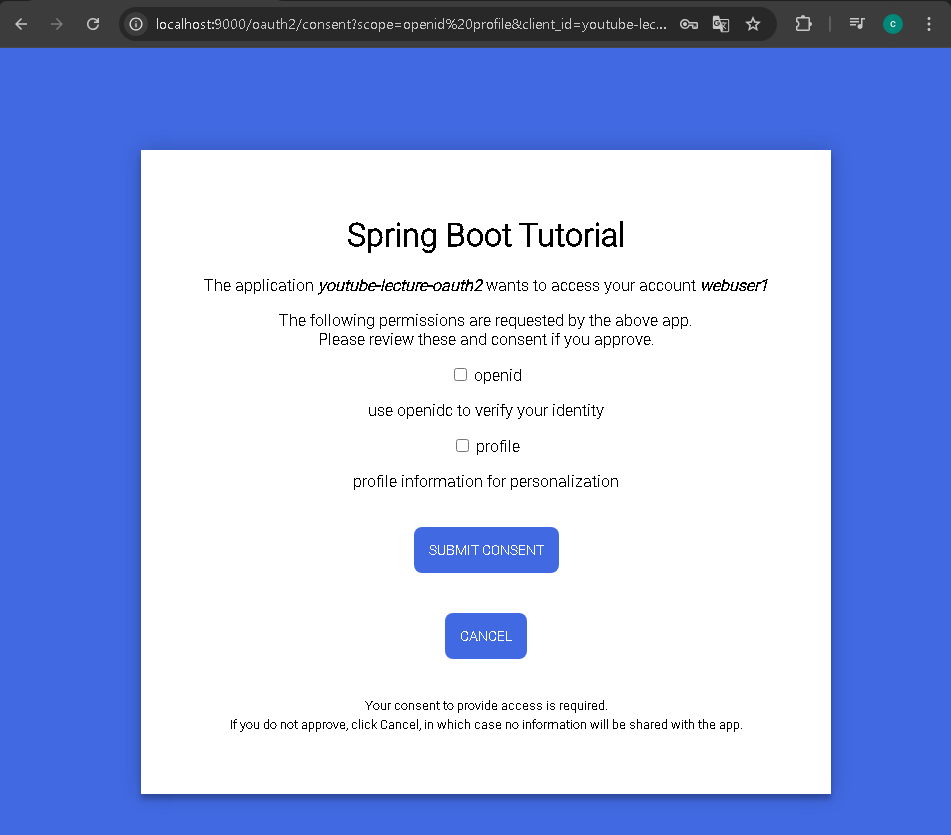

### 
1. JdbcClient   [:8080]
   2. UserDB(MYSQL)
2. RestClient   [:8081]
   3. Webflux
3. Oauth2Client [:8082]
   4. /index(UI)

### MYSQL

[oauth2-registered-client-schema.sql](https://github.com/spring-projects/spring-authorization-server/blob/main/oauth2-authorization-server/src/main/resources/org/springframework/security/oauth2/server/authorization/client/)
```mysql
CREATE TABLE oauth2_registered_client (
    id varchar(100) NOT NULL,
    client_id varchar(100) NOT NULL,
    client_id_issued_at timestamp DEFAULT CURRENT_TIMESTAMP NOT NULL,
    client_secret varchar(200) DEFAULT NULL,
    client_secret_expires_at timestamp DEFAULT NULL,
    client_name varchar(200) NOT NULL,
    client_authentication_methods varchar(1000) NOT NULL,
    authorization_grant_types varchar(1000) NOT NULL,
    redirect_uris varchar(1000) DEFAULT NULL,
    post_logout_redirect_uris varchar(1000) DEFAULT NULL,
    scopes varchar(1000) NOT NULL,
    client_settings varchar(2000) NOT NULL,
    token_settings varchar(2000) NOT NULL,
    PRIMARY KEY (id)
);
```

[oauth2-authorization-consent-schema.sql](https://github.com/spring-projects/spring-authorization-server/blob/main/oauth2-authorization-server/src/main/resources/org/springframework/security/oauth2/server/authorization/oauth2-authorization-consent-schema.sql)
```mysql
CREATE TABLE oauth2_authorization_consent (
    registered_client_id varchar(100) NOT NULL,
    principal_name varchar(200) NOT NULL,
    authorities varchar(1000) NOT NULL,
    PRIMARY KEY (registered_client_id, principal_name)
);
```

[](https://github.com/spring-projects/spring-authorization-server/blob/main/oauth2-authorization-server/src/main/resources/org/springframework/security/oauth2/server/authorization/oauth2-authorization-schema.sql)
```mysql
CREATE TABLE oauth2_authorization (
    id varchar(100) NOT NULL,
    registered_client_id varchar(100) NOT NULL,
    principal_name varchar(200) NOT NULL,
    authorization_grant_type varchar(100) NOT NULL,
    authorized_scopes varchar(1000) DEFAULT NULL,
    attributes blob DEFAULT NULL,
    state varchar(500) DEFAULT NULL,
    authorization_code_value blob DEFAULT NULL,
    authorization_code_issued_at timestamp DEFAULT NULL,
    authorization_code_expires_at timestamp DEFAULT NULL,
    authorization_code_metadata blob DEFAULT NULL,
    access_token_value blob DEFAULT NULL,
    access_token_issued_at timestamp DEFAULT NULL,
    access_token_expires_at timestamp DEFAULT NULL,
    access_token_metadata blob DEFAULT NULL,
    access_token_type varchar(100) DEFAULT NULL,
    access_token_scopes varchar(1000) DEFAULT NULL,
    oidc_id_token_value blob DEFAULT NULL,
    oidc_id_token_issued_at timestamp DEFAULT NULL,
    oidc_id_token_expires_at timestamp DEFAULT NULL,
    oidc_id_token_metadata blob DEFAULT NULL,
    refresh_token_value blob DEFAULT NULL,
    refresh_token_issued_at timestamp DEFAULT NULL,
    refresh_token_expires_at timestamp DEFAULT NULL,
    refresh_token_metadata blob DEFAULT NULL,
    user_code_value blob DEFAULT NULL,
    user_code_issued_at timestamp DEFAULT NULL,
    user_code_expires_at timestamp DEFAULT NULL,
    user_code_metadata blob DEFAULT NULL,
    device_code_value blob DEFAULT NULL,
    device_code_issued_at timestamp DEFAULT NULL,
    device_code_expires_at timestamp DEFAULT NULL,
    device_code_metadata blob DEFAULT NULL,
    PRIMARY KEY (id)
);
```





### DB


### REF
### Chapter01 Authorization Server Custom User
- [Spring Boot 3.2.0 - Spring Authorization Server - Create, Update & Delete Users](https://www.youtube.com/watch?v=h609GfjOdfI)
[ spring_boot_client_04_cleanup_database](https://github.com/wdkeyser02/SpringBootSpringAuthorizationServer/tree/spring_boot_client_04_cleanup_database)

### Chapter02 Authorization Server & Gateway / SpringCloudGatewayAngularTutorial
- [Spring Boot 3 - Spring Cloud Gateway - Angular App - Spring Authorization Server OAuth2](https://www.youtube.com/watch?v=lGVjQxghx9w)
[ authorization_server ](https://github.com/wdkeyser02/SpringCloudGatewayAngularTutorial/tree/authorization_server)
- [Spring Boot 3 - Spring Cloud Gateway - Angular App](https://www.youtube.com/watch?v=NYNIoegNggg)
[ gateway ](https://github.com/wdkeyser02/SpringCloudGatewayAngularTutorial/tree/gateway)

### Chapter03 JWK & 2Factor / SpringSecurityCloudGatewayAngularTutorial
[ authorization_server]
- [Spring Authorization Server - Spring Cloud Gateway - Angular App Setup - Login & Logout](https://www.youtube.com/watch?v=wddvIxi-cCc)
[ resource_server](https://github.com/wdkeyser02/SpringSecurityCloudGatewayAngularTutorial/tree/resource_servers)
- [Spring Authorization Server - Spring Cloud Gateway - Angular App - Spring Boot 3.1.3](https://www.youtube.com/watch?v=0AhK6o39Cvc)
[ cloud_gateway](https://github.com/wdkeyser02/SpringSecurityCloudGatewayAngularTutorial/tree/cloud_gateway)
- [Spring Authorization Server - Spring Cloud Gateway - Angular App - Custom Login & Consent Screen](https://www.youtube.com/watch?v=zp0Ee3Gu0aA)
[ custom_consent](https://github.com/wdkeyser02/SpringSecurityCloudGatewayAngularTutorial/tree/custom_consent)
- [Spring Authorization Server - Spring Cloud Gateway - Angular App - Setup JdbcUserDetailsManager](https://www.youtube.com/watch?v=HLPr7srzILI)
[ jdbc_user_details_manager](https://github.com/wdkeyser02/SpringSecurityCloudGatewayAngularTutorial/tree/jdbc_user_details_manager)
- [Spring Authorization Server Spring Cloud Gateway - Angular App Setup JdbcRegisteredClientRepository](https://www.youtube.com/watch?v=ROlvCxH-q04)
[ jdbc_registered_client_repository](https://github.com/wdkeyser02/SpringSecurityCloudGatewayAngularTutorial/tree/jdbc_registered_client_repository)
- [Spring Authorization Server - Spring Cloud Gateway - Angular App Setup - Enable PKCE](https://www.youtube.com/watch?v=qcj-z7HjqbI)
[ jdbc_registered_client_repository_pkce](https://github.com/wdkeyser02/SpringSecurityCloudGatewayAngularTutorial/tree/jdbc_registered_client_repository_pkce)
- [Spring Authorization Server - Spring Cloud Gateway - Angular App Setup - Enable JDBC Session](https://www.youtube.com/watch?v=KB3P8Y6XeKY)
[ jdbc_session](https://github.com/wdkeyser02/SpringSecurityCloudGatewayAngularTutorial/tree/jdbc_session)
- [Spring Authorization - Server Spring Cloud Gateway - Save Authorization & Consents to a Database](https://www.youtube.com/watch?v=rcNBKzQ2VYk)
[ jdbc_authorization](https://github.com/wdkeyser02/SpringSecurityCloudGatewayAngularTutorial/tree/jdbc_authorization)
- [Spring Authorization Server - Spring Cloud Gateway - Angular App Setup - Keys Config](https://www.youtube.com/watch?v=tcIDW-9bM58)
[ keys](https://github.com/wdkeyser02/SpringSecurityCloudGatewayAngularTutorial/tree/keys)
- [Spring Authorization Server - Spring Cloud Gateway - Angular App Setup - Rotating Keys (1)](https://www.youtube.com/watch?v=UPjIR4xFIkA)
[ rotate_keys](https://github.com/wdkeyser02/SpringSecurityCloudGatewayAngularTutorial/tree/rotate_keys)
- [Spring Authorization Server - Spring Cloud Gateway - Angular App Setup - Rotating Keys (2)](https://www.youtube.com/watch?v=YlibRJj3KuU)
[ jdbc_rotate_keys](https://github.com/wdkeyser02/SpringSecurityCloudGatewayAngularTutorial/tree/jdbc_rotate_keys)
- [Spring Authorization Server - Spring Cloud Gateway - Angular App Setup - Rotating Keys (3)](https://www.youtube.com/watch?v=2l9-flGO-5A)
[ jdbc_rotating_keys_encryptor](https://github.com/wdkeyser02/SpringSecurityCloudGatewayAngularTutorial/tree/jdbc_rotating_keys_encryptor)
[ multi_factor_authentication]
- [Spring Authorization Server - Custom User Details](https://www.youtube.com/watch?v=Z1y16K04joA)
[ custom_user_details_service](https://github.com/wdkeyser02/SpringSecurityCloudGatewayAngularTutorial/tree/custom_user_details_service)
[Spring Authorization Server - Angular App - Multi-Factor authentication - Google Authenticator](https://www.youtube.com/watch?v=RQzbow3ErZs)
[ multi_factor_authenticator_part_02](https://github.com/wdkeyser02/SpringSecurityCloudGatewayAngularTutorial/tree/multi_factor_authenticator_part_02)
